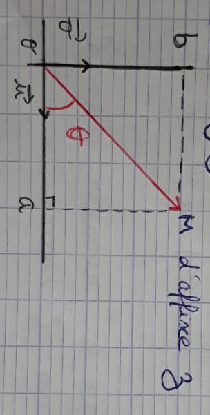
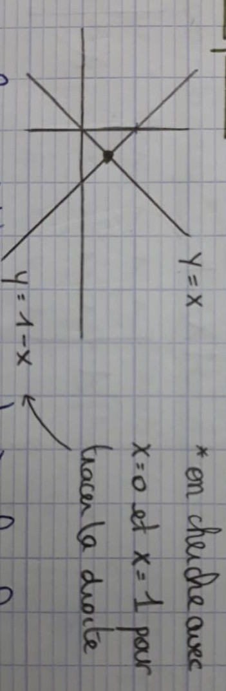
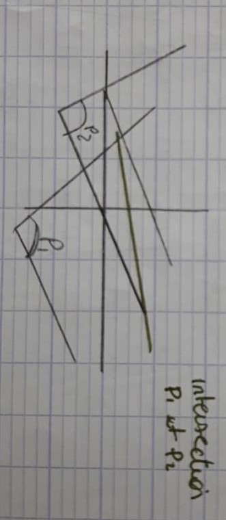
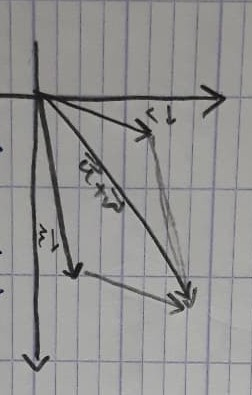
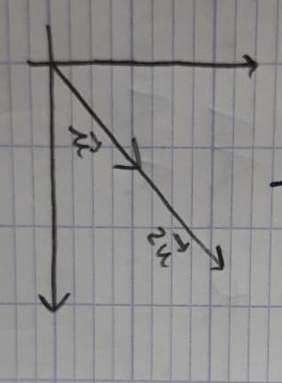
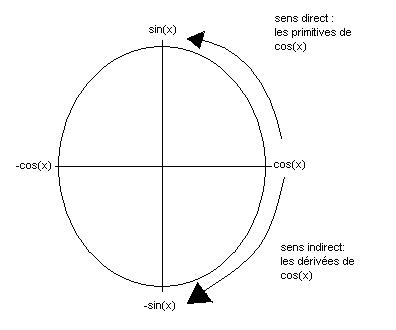

# Mathématiques de Tronc Commun

Professeure : <Manel.TAYACHI@univ-grenoble-alpes.fr> - bureau 230

## Chapitre 1 - Logique mathématique

### A) Fondements

- On part d'un petit nombre d'affirmations, appelées axiomes, supposées vraies *à priori* -> les cinq postulats d'Euclide
- On définit ensuite la notion de démonstration
- On appelle __théorème__ toute affirmation obtenue en fin de démonstration. Une telle affirmation est vraie.
- On constitue ainsi la "vérité" mathématique

### B) Vocabulaire

- **Axiome**. Un axiome est un énoncé supposé vrai a *priori* et que l'on ne cherche pas à démontrer
- **Proposition ou assertion ou affirmation**. Une proposition est un énoncé pouvant être vrai ou faux. Par exemple, "tout nombre premier est impair" et "tout carré de réel est un réel positif" sont deux propositions => cela reste à démontrer.
- **Théorème**. Un théorème est une proposition vraie. Par abus de langage, le mot proposition désigne souvent, dans la pratique des cours de mathématiques, un théorème intermédiaire ou de moindre importance.
- **Corollaire**. Un corollaire à un théorème est un théorème qui est conséquence de ce théorème.
- **Lemme**. Un lemme est un théorème préparatoire à l'établissement d'un théorème de plus grande importance.
- **Conjecture**. Une conjecture est une proposition que l'on suppose vraie sans parvenir à la démontrer.

### C) Quelques rappels

#### I) Logique mathématique

##### 1) Calcul propositionnel

###### a) Équivalence logique

**Définition.** Soient P et Q 2 propositions. Elles sont équivalentes si elles sont simultanément vraies et simultanément fausses.

| $P$ | $Q$ | $P \Leftrightarrow Q$ |
| - | - | - |
| V | V | V |
| V | F | F |
| F | V | F |
| F | F | V |

*Exemple* :

$$x^2 = 1 \Leftrightarrow x = 1\ ou\ x = -1$$

###### b) Négation

**Définition.** Soit $P$ un proposition. On définit sa négation $\bar{P}$ par :

| $P$ | $\overline{P}$ |
| - | - |
| V | F |
| F | V |

$$\forall (x,y) \in \mathbb{R}^2,\ si\ x \leq y\ alors\ f(x) \leq f(y)$$
$$\exists (x,y) \in \mathbb{R}^2\ tq\ x \leq y\ et\ f(x) > f(y)$$
$$\exists n \in \mathbb{N}\ |\ n\ est\ pair$$

**Proposition** : $\overline{\overline{P}} = P$

###### c) Les connecteurs "et" et "ou"

| $P$ | $Q$ | $P \lor Q$|
| - | - | - |
| V | V | V |
| V | F | V |
| F | V | V |
| F | F | F |

| $P$ | $Q$ | $P \land Q$|
| - | - | - |
| V | V | V |
| V | F | F |
| F | V | F |
| F | F | F |

$P \lor Q$ Faux si et seulement si $P$ et $Q$ sont faux simultanément ou inclusif

**Proposition.** Soient $P$ et $Q$ deux propositions,
$$\overline{P \land Q} = \overline{P} \lor \overline{Q}$$
$$\overline{P \lor Q} = \overline{P} \land \overline{Q}$$

###### d) Implication logique
**Définition.** Soient $P$ et $Q$ deux propositions, $P \Rightarrow Q$ est définie par son tableau de vérité :

| $P$ | $Q$ | $P \Rightarrow Q$ |
| - | - | - |
| V | V | V |
| V | F | F |
| F | V | V |
| F | F | V |

On peut penser à plusieurs analogies pour s'aider : un interrupteur et une ampoule (villemin.gerard.free.fr), "Si tu parles, je te tue"...

**Théorème.** Soient $P$ et $Q$ deux propositions, $(P \Rightarrow Q) \Leftrightarrow \overline{P} \lor Q$ (à prouver).

**Théorème.** Si $$(P \Rightarrow Q) \land (Q \Rightarrow R) \Rightarrow (P \Rightarrow R)$$ c'est la transitivité.

**Théorème.** $(P \Leftrightarrow Q) \Leftrightarrow \big((P \Rightarrow Q) \land (Q \Rightarrow P)\big)$

###### e) Condition nécessaire et suffisante (CN et CS)

**Définition.** Soient $P$ et $Q$ deux propositions. Dire que $P$ est **nécessaire** à $Q$ signifie que pour $Q$ soit réalisé il faut que $P$ le soit. Cela revient à dire $Q \Rightarrow P$.

*Exemple.* "Il y a des nuages" Condition Nécessaire de "Il pleut" : "Il pleut" $\Rightarrow$ "Il y a des nuages"

**Remarque.** $P$ peut ne pas être suffisant pour $Q$ c'est-à-dire on peut avoir $P$ réalisé sans que $Q$ ne le soit.

| $\Rightarrow$ | $\Leftarrow$ |
|:-:|:-:|
| CN | CS |
| il faut | il suffit |
| seulement si | si |

###### f) Négation, contraposée et réciproque d'une implication

**Théorème. Négation d'une implication.**
$$\overline{P \Rightarrow Q} \Leftrightarrow P \land \overline{Q}$$

**Théorème. Contraposée d'une implication.**
 $$(P \Rightarrow Q) \Leftrightarrow (\overline{Q} \Rightarrow \overline{P}) $$
 on dit que $\overline{Q} \Rightarrow \overline{P}$ est la contraposé de $P \Rightarrow Q$

**Définition.** La réciproque de $P \Rightarrow Q$ est $Q \Rightarrow P$

##### 2) Les quantificateurs $\forall$ et $\exists$

**Définition.** "Pour tous les éléments de $\mathbb{E}$, la proposition $P(x)$ est vraie" s'écrit "$\forall x \in \mathbb{E},\ P(x)$"

**Définition.** "Il existe au moins un élément de $\mathbb{E}$ tel que la proposition $P(x)$ est vraie" s'écrit "$\exists x \in \mathbb{E},\ P(x)$"

- $\exists!$ : il existe un unique
- $\forall$ : quantificateur universel
- $\exists$ : quantificateur existentiel

- La fonction f est l'identité de $\mathbb{R}$ : $f = Id_{\mathbb{R}}\ |\ \forall x \in \mathbb{R},\ f(x) = x$
- Pour tout point $M$ du plan $\mathcal{P}$, $M$ est sur le cercle $\mathcal{C}$ de centre $\Omega$ et de rayon $R$ ssi la distance de $M$ à $\Omega$ vaut $R$ : $\forall M \in \mathcal{P},\ (M \in \mathcal{C}(\Omega,R) \Leftrightarrow D(M,\Omega) = R,\ \Omega M = R)$

**Théorème.** Soit $E$ un ensemble et $P(x)$ est une proposition dont les valeurs de vérité sont en fonction des éléments $x$ de $E$ :
 - $\big(\forall x \in E,\ P(x)\big) \Leftrightarrow \big(\exists x \in E,\ \overline{P(x)}\big)$
 - $(\exists x \in E,\ P(x)) \Leftrightarrow (\forall x \in E,\ \overline{P(x)})$

## Chapitre 2 - Nombres complexes

- Forme algébrique : $z = a + ib,\ a,b \in \mathbb{R}$
- Conjugué : $\overline{z} = a - ib$
- $\overline{z+z'} = \overline{z} + \overline{z'}$
- $\overline{zz'} = \overline{z}\overline{z'}$

$$|z| = \sqrt{a^2 + b^2} = \sqrt{z\overline{z}}$$
$$arg(z) = (\overrightarrow{u}; \overrightarrow{OM})\ modulo\ 2\pi$$

**Propriété.** Soit $z \in \mathbb{C}* \exists r > 0$ et $\theta \in \mathbb{R}$ tq $$z = r \cos{\theta} + i*r*\sin{\theta}$$ avec $r = |z|$ et $\theta = arg(z)$.
Si $z = a + ib$ alors $r = \sqrt{a^2 + b^2}$, $\cos{\theta} = {a \over r} = {a \over \sqrt{a^2 + b^2}}$, $\sin{\theta} = {b \over \sqrt{a^2 + b^2}}$

**Définition.**
$$\forall \theta \in \mathbb{R},\ e^{i\theta} = \cos(\theta) + i\sin(\theta)$$
$$\forall x \in \mathbb{R},\ e^x = \displaystyle\sum_{k=0}^{+\infty} {x^k \over k!}$$
$$\forall \theta \in \mathbb{R},\ e^{i\theta} = \displaystyle\sum_{k=0}^{+\infty} {(i\theta)^k \over k!} = \cos(\theta) + i\sin(\theta)$$
$$e^{i(\theta+\theta')} = e^{i\theta}e^{i\theta'}$$
$$(e^{i\theta})^n = e^{in\theta}$$

**Définition.** Tout complexe z non nul de module $z$ et d'argument $\theta$ s'écrit $z = re^{i\theta}$
$$e^{i2\pi} = 1$$
$$e^{2ik\pi} = 1,\ \forall k \in \mathbb{Z}$$
$$e^{ik\pi} = (-1)^k$$
$$|e^{i\theta}| = 1,\ \forall \theta \in \mathbb{R}$$

**Propriété.** $\forall \theta \in \mathbb{R}$
$\cos{\theta} = {e^{i\theta}+ e{-i\theta} \over 2}$, $\sin{\theta} = {e^{i\theta} - e^{-i\theta} \over 2i}$
Application : soit $z \in \mathbb{C}*$, résoudre $Z^n = z$
$$z = re^{i\theta}$$
$Z = Re^{i\alpha}$, les inconnues sont $R$ et $\alpha$.
$$R^ne^{in\alpha} = re^{i\theta}$$
$$\Leftrightarrow R^n = r \Leftrightarrow R = r^{1\over n} / n\alpha = \theta + 2k\pi\ k\in\mathbb{Z}$$
$$\Leftrightarrow R = r^{1\over n} = \sqrt[n]{r} / \alpha = {\theta + 2k\pi\over n}\ k \in \{0, 1, .., n-1\}$$

*Exemple.* Résoudre $Z^3 = -1 = e^{i\pi}$
$$\Leftrightarrow Z^3 = R^3e^{i3\alpha} = e^{i\pi}$$
$$\Leftrightarrow R = 1 \\ \alpha = {\pi \over 3}$$
ou
$$\Leftrightarrow Z^3 = (a + ib)^3 = -1$$
$$\Leftrightarrow a = -1$$
Donc $Z^3 = - 1$ avec $Z = e^{i\pi + 2k\pi,\ k \in \mathbb{Z} }$ ou $Z = e^{i{\pi \over 3} + {2k\pi \over 3},\ k\in \mathbb{Z}}$
- Application 2, résoudre dans $\mathbb{C}$ : $aZ^2 + bZ + c = 0,\ a,b,c \in \mathbb{C}$ et $\Delta = b^2 - 4ac \in \mathbb{C}$
- Il suffit de trouver $\delta \in \mathbb{C}$  ($\delta = a + ib$) tq $\delta^2 = \Delta$
$$Z = {-b \pm \delta \over 2a}$$
(deux racines complexes)

## Chapitre 3 - Algèbre linéaire
remi-molinier@univ-grenoble-alpes.fr

### A) Rappels

#### 1) Systèmes linéaires

*Exemple.*
$$
\left \{
\begin{array}{c @{=} c}
    2x + y + z + t = 1 \\
    x - y - z = 0 \\
\end{array}
\right.
$$

##### a) Interprétation géométrique

- Avec 2 variables :

$$
\left \{
\begin{array}{c @{=} c}
    x + y = 1 \\
    x - y = 0 \\
\end{array}
\right.
$$

Résoudre un système avec deux variables revient à chercher l'intersection de droites du plan, donc un ont ou une droite.

- Avec 3 variables :

$$
\left \{
\begin{array}{c @{=} c}
    x + y + z = 1\ (\mathcal{P}1) \\
    x - y - z = 0 \\
\end{array}
\right.
$$

Résoude un système avec trois variables revient à chercher l'intersection de plans de l'espace $\mathbb{R}^3$, donc une droite ou un plan.

##### b) Différentes façons d'écrire un système

- Avec des équations :

  *Exemple.*
  $$
  \left \{
  \begin{array}{c @{=} c}
      x + y + z + t = 1\\
      x - y + t = 0 \\
  	x - z + 2t = 2
  \end{array}
  \right.
  $$

- Avec la matrice augmentée du système

  $$
  \begin{bmatrix}
  1 && 1 && 1 && 1 && | && 1\\
  1 && -1 && 0 && 1 && | && 0\\
  1 && 0 && -1 && 2 && | && 2\\
  \end{bmatrix}
  $$

  Les lignes sont $E1$, $E2$ et $E3$ ; les colonnes de gauche sont $x$, $y$, $z$ et $t$.

- Forme matricielle

$$AX = b$$

$$ A =
\begin{bmatrix}
1 && 1 && 1 && 1\\
1 && -1 && 0 && 1\\
1 && 0 && -1 && 2\\
\end{bmatrix}
X =
\begin{bmatrix}
x \\
y \\
z \\
t \\
\end{bmatrix}
b = \begin{bmatrix}
1 \\
0 \\
2 \\
\end{bmatrix}
$$

##### c) Rappel du produit matriciel

Possible ssi $Nb\ col\ A = Nb\ ligne\ B$
$$A \in \mathbb{R}^{m \times n},\ B \in \mathbb{R}^{n \times l}$$

*Exemple.*

$$
\begin{bmatrix}
1 && 1 && 1 && 1\\
1 && -1 && 0 && 1\\
1 && 0 && -1 && 2\\
\end{bmatrix}
\times
\begin{bmatrix}
x \\
y \\
z \\
t \\
\end{bmatrix} =
\begin{bmatrix}
x + y + z + t\\
x - y + t\\
x - z + 2t\\
\end{bmatrix}
$$

##### d) Opérations élémentaires

- Permutation
  - Système
		$Ei \leftrightarrow Ej$
		*Exemple.*
  $$
  \left \{
  \begin{array}{c @{=} c}
      x + y = 0\\
      x - y = 1\\
  \end{array}
  \right.
  \Leftrightarrow
  \left \{
  \begin{array}{c @{=} c}
      x - y = 1\\
      x + y = 0\\
  \end{array}
  \right.
  $$
  - Matrice augmenté
		$Li \leftrightarrow Lj$
		*Exemple.*
  $$
  \begin{bmatrix}
  1 && 1 && | && 0\\
  1 && -1 && | && 1\\
  \end{bmatrix} =
  \begin{bmatrix}
  1 && -1 && | && 1\\
  1 && 1 && | && 0\\
  \end{bmatrix}
  $$
    - Forme matricielle : multiplier à gauche par (lignes $j$ et $i$, colonnes $i$ et $j$)
$$
\begin{bmatrix}
1      && \cdots  && \cdots && \cdots && 1\\
\vdots && 0       && \cdots && 1      && \vdots\\
\vdots && \vdots  && \ddots && \vdots && \vdots\\
\vdots && 1       && \cdots && 0      && \vdots\\
1      && \cdots  && \cdots && \cdots && 1\\
\end{bmatrix}
$$

- Dilatation
	- Système
		$Ei \leftarrow \lambda Ei$
		*Exemple.*
  $$
  \left \{
  \begin{array}{c @{=} c}
      x + y = 0\\
      x - y = 1\\
  \end{array}
  \right.
  \Leftrightarrow
  \left \{
  \begin{array}{c @{=} c}
      x + y = 1\\
      2x - 2y = 2\\
  \end{array}
  \right.
  $$
	- Matrice augmenté
		$Li \leftarrow \lambda Li$
		*Exemple.*
  $$
  \begin{bmatrix}
  1 && 1 && | && 0\\
  1 && -1 && | && 1\\
  \end{bmatrix} =
  \begin{bmatrix}
  1 && 1 && | && 0\\
  2 && -2 && | && 2\\
  \end{bmatrix}
  $$
	- Forme matricielle **incomplet**

- Combinaison linéaire d'équation
	- Système
		$Ei \leftarrow Ei + \lambda Ej$
		*Exemple.*
  $$
  \left \{
  \begin{array}{c @{=} c}
      x + y = 0\\
      x - y = 1\\
  \end{array}
  \right.
  \Leftrightarrow
  \left \{
  \begin{array}{c @{=} c}
      x + y = 0\\
      - 2y = 0\\
  \end{array}
  \right.
  $$
	- Matrice augmentée
	    $Li \leftarrow Li + \lambda Lj$
        *Exemple.* ($L2 \leftarrow L2 - L1$)
  $$
  \begin{bmatrix}
  1 && 1 && | && 0\\
  1 && -1 && | && 1\\
  \end{bmatrix}
  \sim
  \begin{bmatrix}
  1 && 1 && | && 0\\
  0 && -2 && | && 1\\
  \end{bmatrix}
  $$
    - Forme matricielle **incomplet**

##### e) Algorithme de Gauss

**Idée**

- **Étape 1.** Avec les opérations élémentaires (surtout la 3ième) on met le système sous forme triangulaire en utilisant des **pivots**
    *Exemple.*

$$
\left \{
\begin{array}{c @{=} c}
    x + y + z = 1 \\
    - x - y - z - 2t = 1 \\
    - x + y + 2z + t = 1 \\
\end{array}
\right.
$$

$$
\begin{bmatrix}
1 && 1 && 1 && 1 &&| && 1\\
-1 && -1 && -1 && -2 && | && 1\\
1 && 1 && 2 && 1 && | && 1\\
\end{bmatrix}
\underset{\underset{L3 \leftarrow L3 - L1}{L2 \leftarrow L2 + L1}}{\sim}
\begin{bmatrix}
1 && 1 && 1 && 1 && | && 1\\
0 && 0 && 0 && - 2&& | && 2\\
0 && 0 && 1 && 0 && | && 0\\
\end{bmatrix}
$$

$$
\underset{L3 \leftrightarrow L2}{\sim}
\begin{bmatrix}
1 && 1 && 1 && 1 && | && 1\\
0 && 0 && 1 && 0 && | && 0\\
0 && 0 && 0 && -1 && | && 2\\
\end{bmatrix}
$$

$$\textrm{(y est "libre")}$$

$$
\left \{
\begin{array}{c @{=} c}
    x + y + z + t = 1 \\
    z = 0 \\
    -t = 2 \\
\end{array}
\right. $$

- **Étape 2.** Résoudre le système en remontant
	*Exemple.*

$$
\left \{
\begin{array}{c @{=} c}
    x + y + 0 - 2 = 1 \\
    z = 0 \\
    t = -2 \\
\end{array}
\right.
\Leftrightarrow
\left \{
\begin{array}{c @{=} c}
    x = 3 - y \\
    z = 0 \\
    t = -2 \\
\end{array}
\right.
$$

$$
S =
\left \{
\begin{array}{c @{=} c}
    \begin{bmatrix}
    x\\
    y\\
    z\\
    t\\
    \end{bmatrix}
    =
    \begin{bmatrix}
    z-y\\
    y\\
    0\\
    -z\\
    \end{bmatrix}\ |\ y \in \mathbb{R}\\
\end{array}
\right \}
$$

$$
S =
\left \{
\begin{array}{c @{=} c}
    \begin{bmatrix}
    x\\
    y\\
    z\\
    t\\
    \end{bmatrix} =
	\begin{bmatrix}
    3\\
    0\\
    0\\
    -2\\
    \end{bmatrix} + y
	\begin{bmatrix}
    -1\\
    1\\
    0\\
    0\\
    \end{bmatrix}\ |\ y \in \mathbb{R}
\end{array}
\right \}
$$

$$
\textrm{C'est la droite passant par $(3,0,0,-2)$ et de vecteur directeur }
\begin{bmatrix}
    -1\\
    1\\
    0\\
    0\\
    \end{bmatrix}
$$

##### f) Ensemble des solutions d'un système

**3 cas**
- $S = 0$
	*Exemple.*
$$
\left \{
\begin{array}{c @{=} c}
    x + y = 0 \\
    x + y = 1 \\
\end{array}
\right.,
\begin{bmatrix}
    1 && 1 && | && 0\\
    1 && 1 && | && 1\\
    \end{bmatrix}
\underset{L2 \rightarrow L2 - L1}{\sim}
\begin{bmatrix}
    1 && 1 && | && 0\\
    0 && 0 && | && 1\\
\end{bmatrix}
0 = 1\ impossible
$$

- Il y a une unique solution
    *Exemple.*
$$
\left \{
\begin{array}{c @{=} c}
x+y = 0 \\
x-y = 1 \\
\end{array}
\right.
$$

$$
\begin{bmatrix}
1 && 1 && | && 0\\
1 && -1 && | && 1\\
\end{bmatrix}
\underset{L2 - L1 \rightarrow L2}{\sim}
\begin{bmatrix}
1 && 1 && | && 0\\
0 && -2 && | && 1\\
\end{bmatrix}
$$

$$
\left \{
\begin{array}{c @{=} c}
x+y = 0 \\
-2y = 1 \\
\end{array}
\right.
\Leftrightarrow
\left \{
\begin{array}{c @{=} c}
x = -y = 1/2 \\
y = -1/2 \\
\end{array}
\right.
$$

$$
S =
\begin{Bmatrix}
1 && 1 && | && 0\\
0 && -2 && | && 1\\
\end{Bmatrix}
$$

- Il y a une infinité de solutions
    *Exemple.*
  $$
  \left \{
  \begin{array}{c @{=} c}
  x+y = 1 \\
  2x+2y = 2 \\
  \end{array}
  \right.
  $$
  $$
  \begin{bmatrix}
  1 && 1 && | && 1\\
  2 && 2 && | && 2\\
  \end{bmatrix}
  \underset{L2 \leftarrow L2 - 2L1}{\sim}
  \begin{bmatrix}
  1 && 1 && | && 1\\
  0 && 0 && | && 0\\
  \end{bmatrix}
  $$
  $$
  \left \{
  \begin{array}{c @{=} c}
  x+y = 0 \\
  0 = 0 \\
  \end{array}
  \right.
  $$
  $$
  S =
  \begin{Bmatrix}
    \begin{bmatrix}
    x \\ y\\
    \end{bmatrix}
    =
    \begin{bmatrix}
    1 - y\\ y\\
    \end{bmatrix}
    |\ y \in \mathbb{R}
  \end{Bmatrix}
  $$
  $$
  =
  \begin{Bmatrix}
    \begin{bmatrix}
    x \\ y\\
    \end{bmatrix}
    =
    \begin{bmatrix}
    1 \\ 0\\
    \end{bmatrix}
    + y
    \begin{bmatrix}
    -1 \\ 1\\
    \end{bmatrix}
  \end{Bmatrix}
  $$
  Droite passant par (1, 0) et de vecteur directeur $\begin{bmatrix} -1 \\ 1\\ \end{bmatrix}$
##### g) Une variante : Gauss Jordan

- **Étape 1** : Pareil que pour Gauss
- **Étape 2** "annuler les entrée au dessus du pivot en commençant par la fin"

$$
\begin{bmatrix}
1 && 1 && 1 && 1 | && 1\\
0 && 1 && 1 && 1 | && 1\\
0 && 0 && 0 && 1 | && 1\\
\end{bmatrix}
\underset{\underset{L1 \leftarrow L1 - L3}{L2 \leftarrow L2 - L3}}{\sim}
\begin{bmatrix}
1 && 1 && 1 && 0 | && 0\\
0 && 1 && 1 && 0 | && 0\\
0 && 0 && 0 && 1 | && 1\\
\end{bmatrix}
$$

$$
\underset{L1 \leftarrow L1 - L2}{\sim}
\begin{bmatrix}
1 && 0 && 0 && 0 | && 0\\
0 && 1 && 1 && 0 | && 0\\
0 && 0 && 0 && 1 | && 1\\
\end{bmatrix}
$$

$$
\left \{
\begin{array}{c @{=} c}
x = 0 \\
y + z = 0 \\
t = 1 \\
\end{array}
\right.
\Leftrightarrow
\left \{
\begin{array}{c @{=} c}
x = 0 \\
y = -z \\
t = 0 \\
\end{array}
\right.
$$

$$
S =
\begin{Bmatrix}
    \begin{bmatrix}x\\y\\z\\t\end{bmatrix}
    =
	\begin{bmatrix}0\\-z\\z\\1\end{bmatrix}
    =
    \begin{bmatrix}0\\0\\0\\1\end{bmatrix}
    + z
    \begin{bmatrix}0\\-1\\1\\0\end{bmatrix}
	\ |\ z \in \mathbb{R}
\end{Bmatrix}
$$

#### 2) Matrices

$$
A = \begin{bmatrix}
a_{11} && \cdots && a_{1m}\\
a_{21} && \cdots && a_{2m}\\
\vdots &&        && \vdots\\
a_{n1} && \cdots && a_{nm}\\
\end{bmatrix} =
\begin{bmatrix}aij\end{bmatrix}
$$

$$ \mathbb{R}^{m \times n} = \mathcal{M}_{m,n}(\mathbb{R}) = \textrm{ensemble des matrices}\ m \times n$$

##### a) Opérations

$A,\ B \in \mathbb{R}^{m \times n},\ \lambda \in \mathbb{R}$

- $A + B = [a_{ij} + b_{ij}]$
- $\lambda 1 = [\lambda a_{ij}$

Muni de ces opérations, $\mathcal{M}_{m, n}$ est un $\mathbb{R}$-espace vectoriel (les règles de calcul avec les vecteurs du $\mathbb{R}^n$ fonctionnent pareil ici).

*Exemples.* Soient $A\ B$ deux matrices, $A+B$ et $3A$.

Si $m=n$ on parle de matrice carrée et on note $\mathbb{R}^{n \times n} = \mathcal{M}_{n,n}(\mathbb{R}) = \mathcal{M}_{n}(\mathbb{R})$

On a maintenant un produit en plus.

> Attention $AB \neq BA$ (en général)
> Le produit n'est pas commutatif !

*Exemples.*

- Essayer avec les matrices $\begin{bmatrix}0&&0\\0&&1\end{bmatrix}$ et $\begin{bmatrix}0&&1\\0&&0\end{bmatrix}$
- $(A+B)^2 = A^2 + AB + BA + B^2 \neq A^2 + 2AB + B^2$

##### b) Unité

$$
I_n =
\begin{bmatrix}
1 &&        && 0\\
  && \ddots &&\\
0 &&        && 1\\
\end{bmatrix}
$$

##### c) Inverse

$$x \in \mathbb{R}^* xx^{-1} = 1$$

Si $A \in \mathcal{M}_n(\mathbb{R})$ est inversible $\exists ! A^{-1} \in \mathcal{M}_n(\mathbb{R})$ telle que $AA^{-1} = I_n$ et $A^{-1}A = I_n$

On peut trouver l'inverse en appliquant la méthode des pivots de Gauss :

$$[A |I_n] \underset{\textrm{Gauss Jordan sur A}}{\sim} [I_n | A^{-1}]$$

Quand $A$ n'est pas inversible, vous ne pourrez pas finir avec $[I_n | A^{-1}]$.

Pour les matrices $2 \times 2$, $A$ est inversible ssi $det() = ad-bc \neq 0$ et alors $A^{-1} = {1 \over det(A)} \begin{bmatrix}d&&-b\\-c&&a\end{bmatrix}$

**Pourquoi ça marche ?**

$$
AX = I_n \underset{Gauss-Jordan}{\sim} E_3E_2E_1AX = E_3E_2E_2I_n \Leftrightarrow X = E_3E_2E_1I_n = A^{-1}
$$

#### 3) Espaces vectoriels
Avoir en tête $\mathbb{R}^n$

Dans $\mathbb{R}^n$ on peut voir chaque point comme un vecteur. On peut alors faire la somme de 2 vecteurs

![Schéma d'un vecteur dans R^3]

On peut alors faire la somme de deux vecteurs

$$u = \begin{bmatrix} u_1 \\ u_2 \\ \end{bmatrix}\ et\ v = \begin{bmatrix} v_1 \\ v_2 \\ \end{bmatrix}\ u+v = \begin{bmatrix} u_1 + v_1 \\ u_2 + v_2 \\ \end{bmatrix}\ $$

et multiplier un vecteur par un scalaire

$$u = \begin{bmatrix} u_1 \\ u_2 \\ \end{bmatrix}\ ,\ \lambda u = \begin{bmatrix} \lambda u_1 \\ \lambda u_2 \\ \end{bmatrix}$$

u=

**Règles de calcul. :**

- $\lambda (u+v) = \lambda u + \lambda v$
- $u + v = v + u$
- $(\lambda + \mu) u = \lambda u + \mu u$
- $\lambda (\mu u) = (\lambda \mu)u = \mu (\lambda u)$
- $(u+v)+w = u+(v+w)$
- $u + 0 = u$
- $1u = u$
- $u + (-1)u = u - u = 0$

(voir la définition d'un espace vectoriel sur Wikipédia)

Plus généralement, un $\mathbb{R}$-espace vectoriel c'est  un ensemble. E dont les éléments sont appelés vecteurs muni d'opérations :
- $+$ : $\begin{array}{c @{=} c} E \times E \rightarrow E\\
(u, v) \mapsto u + v \\ \end{array}$
- $\cdot$ : $\begin{array}{c @{=} c}\mathbb{R} \times E \rightarrow E\\
(\lambda, v) \mapsto \lambda u\\ \end{array}$

qui vérifient les règles de calcul précédentes

*Exemples.*

- $$\mathcal{M}_{m,n} = \mathbb{R}^{m \times n}$$
$$A + B = [a_{ij} + b_{ij}]$$
$$\lambda A = [\lambda a_{ij}]$$
- Espaces des fonctions de $\mathbb{R} \rightarrow \mathbb{R}$
	$$E = \{ F:\mathbb{R} \rightarrow \mathbb{R} \}$$
- Suites réelles : $E = \{(u_n)_{n \in \mathbb{R} } | \forall n \in \mathbb{N}, u_n \in \mathbb{R}\}$
  $$
  (u_n) + (v_n) = (u_n + v_n)
  $$
  $$
  \lambda(u_n) = (\lambda u_n)
  $$_

#### 4) Sous espaces vectoriels
$E$ est un ev $(E=\mathbb{R}^n)$, un sev de $E$ c'est un sous-ensemble non vide $F$ de $E$ stable par combinaison linéaire
$$x,y \in F \Leftrightarrow \lambda x + \mu y \in F \forall \lambda,\mu \in \mathbb{R}$$

Remarque : Si $F$ est un sev, $O \in F$

*Exemples.*
- Dans $\mathbb{R}^2$
	- $\{0\}$ sev de dim 0
	- droite passant par 0. sev de dim 1
	- $\mathbb{R}^2$. sev de dim 2

![Schéma d'un sev dans R2]
- Dans $\mathbb{R}^3$
	- $\{0\}$ sev de dim 0
	- droite passant par 0. sev de dim 1
	- plan passant par 0. sev de dim 2
	- $\mathbb{R}^3$. sev de dim 3

## Chapitre 3 - Étude d'une fonction d'une variable réelle

### A) Fonctions usuelles

- Fonctions **affines** : $\begin{array}{c @{=} c} \mathbb{R} \rightarrow \mathbb{R}\\
  x \mapsto ax+b\\ \end{array}$  

  *Exemple.* ![Schéma d'une fonction affine]

- Fonctions **puissances** : $\begin{array}{c @{=} c} \mathbb{R} \rightarrow \mathbb{R}\\
  x \mapsto x^n \\ \end{array}$  

  *Exemples.* ![Schéma de fonctions puissances]

> Si n pair, $x \mapsto x^n$ est une fonction **paire** ($\forall, f(-x) = f(x)$)

> Si n impair, $x \mapsto x^n$ est une fonction **impaire** ($\forall, f(-x) = -f(x)$)

- Fonctions **sin** : $\begin{array}{c @{=} c} \mathbb{R} \rightarrow \mathbb{R}\\
  x \mapsto sin(x) \\ \end{array}$

- Fonction **cos** : $\begin{array}{c @{=} c} \mathbb{R} \rightarrow \mathbb{R}\\
    x \mapsto cos(x) \\ \end{array}$  

*Exemples.* ![Schémas de fonctions sin et cos]

> sin et cos sont $2\pi$-périodiques ($f(x + 2\pi) = f(x)$)

> sin impaire

> cos paire

- Fonctions **exponentielle** : $\begin{array}{c @{=} c} \mathbb{R} \rightarrow \mathbb{R}\\  x \mapsto e^x \\ \end{array}$  

- Fonction **ln** : $\begin{array}{c @{=} c} \mathbb{R_+^*} \rightarrow \mathbb{R}\\  x \mapsto ln(x) \\ \end{array}$

> $exp$ et $ln$ sont des fonctions **réciproques** l'une de l'autre. C'est-à-dire :
> - $\forall x > 0,\ e^{ln(x)} = x$
> - $\forall x \in \mathbb{R},\ ln(e^x) = x$

*Exemples.* ![Schémas de fonctions exponentielle et log]

- Fonctions **puissance** généralisées : $\begin{array}{c @{=} c} \mathbb{R_+^*} \rightarrow \mathbb{R}\\ x \mapsto x^\alpha = e^{\alpha ln(x)},\ \alpha \in \mathbb{R}^+ \\ \end{array}$  

*Exemple.*
$x^{1 \over 2} = \sqrt{x}$  
![Schéma de fonctions puissance]

### B) Dérivation

**Définition.** $F : I \rightarrow \mathbb{R}, a \in I$
- $f$ est **dérivable en a** si ${f(a + h) - f(a) \over h}$  admet une limite quand $h \rightarrow 0$. Cette limite est alors noté $f'(a)$.
- $f$ est **dérivable sur $I$** si elle est dérivable en tout point de $I$.

*Exemple.* $f : \begin{array}{c @{=} c} \mathbb{R} \rightarrow \mathbb{R}\\ x \mapsto x^2 \\ \end{array}$  
$a \in \mathbb{R}$  
$$
{f(a + h) - f(a) \over h} = {(a + h)^2 - a^2 \over h}
$$
$$
= 2a + h \underset{h \rightarrow 0}{\rightarrow} 2a
$$

Donc $f$ est dérivable en $a$ et $f'(a)=2a$ ;
ainsi, $f$ est dérivable sur $\mathbb{R}$ et $f'(x) = 2x$.

*Exemple.* Code $\LaTeX$ pour deux choses en-dessous : $\lim\limits_{\substack{x \rightarrow -2 \\ x>-2}} f(x)$

> Remarque.
> - $f$ est dérivable en $a$ $\Rightarrow$ $f$ est continue en $a$  
> *Exemple.* Une fonction non continue en $0$ donc non dérivable en $0$
> ![Schémas]

#### 1) Interprétation géométrique

![Schéma taux d'accroissement / tangente]

$f'(a) =$ coefficient directeur de la tangente au graphe en $a$

##### a) Équation de la tangente

Si $(x, y) \in$ Tangente,
$$
{y - f(a) \over x - a} = f'(a) \Rightarrow \boxed{y = f'(a)(x - a) + f(a)}
$$

#### 2) Calcul de dérivées

##### a) Dérivées des fonctions usuelles

$f(x)$                   | $f'(x)$
-------------------------|------------------------
$b$                      | $0$
$ax$                     | $a$
$n \in \mathbb{Z},\ x^n$ | $nx^{n - 1}$
$e^x$                    | $e^x$
$ln(x)$                  | $1 \over x$
$cos(x)$                 | $-sin(x)$
$sin(x)$                 | $cos(x)$
$x^\alpha$               | $\alpha x^{\alpha - 1}$
  |  

*Exemple.* $\begin{array}{c @{} c} F: [0,+ \infty [\rightarrow \mathbb{R}\\ x \mapsto \sqrt{x} \\ \end{array}$  non dérivable en 0

##### b) Formules de somme, produit, quotient

Soient $u,v$ deux fonctions dérivables :

$$
(u + v)' = u' + v' \\
(\lambda u)' = \lambda u' (\lambda \in \mathbb{R}) \\
(uv)' = u'v + uv' \\
\Big({u \over v}\Big)' = {u-v - uv' \over v^2}
$$

*Exemple.* $\big({1 \over u}\big)' = {-u' \over u^2}$

###### c) Composée de fonctions

Soient $u,v$ deux fonctions : $u \circ v(x) = u(v(x))$

*Exemple.*

$$u : \begin{array}{c @{} c} \mathbb{R} \rightarrow \mathbb{R}\\ x \mapsto e^x \\ \end{array}$$

$$v : \begin{array}{c @{} c} \mathbb{R} \rightarrow \mathbb{R}\\ x \mapsto x^2 + 1 \\ \end{array}$$

$$f = u \circ v(x) = u(v(x)) \\
= u(x^2 + 1)
= e^{x^2 + 1}
$$

**Dérivée d'une composée** : $(u \circ v)' = (u' \circ v)v'(x)$

*Exemple.* $f'(x) = (u' \circ v)(x)v'(x) = e^{v(x)}v'(x) = (e^{x^2+1})(2x) = 2xe^{x^2+1}$, sachant que $u'(x) = e^x$

**Applications.**

Forme 1  | Forme 2
:--:|:--:
$(u^n)'$ | $nu^{n-1}u'$  
$e^u$  | $u'e^u$  
$ln(u)$  | $u' \over u$  
$cos(u)$  | $-sin(u)u'$  
$sin(u)$  | $cos(u)u'$  

##### d) Théorèmes importants

**Théorème** (lien dérivée et variation). Soit $f : I \Rightarrow \mathbb{R}$ dérivable
- $\forall x \in I, f'x) > 0 \Leftrightarrow F$ est strictement **croissante** sur $I$
- $\forall x \in I, f'x) < 0 \Leftrightarrow F$ est strictement **décroissante** sur $I$
- $\forall x \in I, f'x) = 0 \Leftrightarrow F$ est **constante** sur $I$

*Exemple.* $f(x) = (x^3 + 1)^7 = u \circ v(x)$ avec $u(x) = x^7,\ u'(x) = 7x^6,\ v(x) = x^3 + 1,\ v'(x) = 3x^2$
Alors $f'(x) = u'(v(x))v'(x) = 7(x^3 + 1)3x^2 = \stackrel{> 0}{21x^2} \times \stackrel{> 0}{(x^3 + 1)^6}$

![tableau de variation]

**Théorème (TVI ou Théorème des Valeurs Intermédiaires).**  
Soit $f : [a, b] \Rightarrow \mathbb{R}$ continue.   
Soit $y$ compris entre $f(a)$ et $f(b)$  
Alors $\exists x \in [a, b]\ tq\ f(x) = y$

*Exemple.*  
$$
x^7 + x + \pi \\
f'x) = 7x^6 + 1 > 0$$
Donc $f$ strictement croissante

![tableau de variation]

Par le TVI, $\exists x_0 \in \mathbb{R}$ tq $x_{0}^7 + x_0 + \pi = 0$ et comme $f$ est strictement croissante $x_0$ est unique

**Théorème (Rolle).**

$f : [a,b] \rightarrow \mathbb{R}$
- $f$ continue sur $[a,b]$
- $f$ dérivable sur $]a,b[$
- $f(a) = f(b)$  

Alors $\exists c \in ]a,b[$ tq $f'(c) = 0$

![Graphe d'une fonction qui respecte le théorème de Rolle]

**Théorème (TAF ou Théorème des Accroissements Finis).**

$f : [a,b] \rightarrow \mathbb{R}$
- $f$ continue sur $[a,b]$
- $f$ dérivable sur $]a,b[$

Alors $\exists c \in ]a,b[$ tq $f'(c) = {f(b) - f(a) \over b - a}$

![Graphe d'une fonction qui respecte le TAF]

**Inegalité des accroissements finis**

$f : [a,b] \rightarrow \mathbb{R}$
- $f$ continue sur $[a,b]$
- $f$ dérivable sur $]a,b[$
- $\exists m, M\ tq\ m \leq f'x) \leq M\ \forall x \in [a,b]$

Alors $m(b-a) \leq f(b) - f(a) \leq M(b-a)$

### C) Développements limités

#### 1) Formule de Taylor Young

Soit $f \in C^n (I, \mathbb{R})$ (c'est-à-dire $n$ fois dérivable et $F^{(n)}$ continue) et $a \in I$,

Alors $f(a+h) = f(a) + hf'(a) + {h^2 \over 2!}f''(a) + {h^3 \over 3!}f^{(3)}(a) + \dots + {h^n \over n!}f^{(n)}(a) + \stackrel{=h^n\epsilon(h)}{o(h^n)}$

> Remarques.
> - $o(h^n)$ : négligeable devant $h^n$ quand $h \rightarrow 0$
> - $\epsilon(h)$ : fonction qui tend vers $0$ quand $h \rightarrow 0$

*Exemple.* $f(x) = e^x$ et en 0 (pour toutes ces équations) :
$$
e^x = 1 + x + {x^2 \over 2!} + {x^3 \over 3!} + \dots + {x^n \over n!} + o(X^n)\\
cos(x) = 1 - {x^2 \over 2!} + {x^4 \over 4!} + \dots + {(-1)^n \over (2n)!}x^{2n} + o(x^{2n}) \\
sin(x) = x - {x^3 \over 3!} + {x^5 \over 5!} - \dots + {(-1)^nx^{2n + 1} \over (2n + 1)!} + o(x^{2n + 1})$$

#### 2) Développements limités classiques en 0

$$
{1 \over 1 - x} = 1 + x + x^2 + \dots + x^n + o(x^n) \\
{1 \over 1 + x} = 1 - x + x^2 - x^3 + \dots (-1)^nx^n + o(x^n) \\
ln(1+x) = x - {x^2 \over 2} + {x^3 \over 3} - \dots + (-1)^{n+1}{x^n \over n} + o(x^n)\\
(1 + x)^\alpha = 1 + \alpha x + {\alpha (\alpha - 1) \over 2!}x^2 + {\alpha (\alpha - 1)(\alpha - 2) \over 3!}x^3 + \dots + {\alpha (\alpha - 1)(\alpha - 2) \dots (\alpha - n + 1) \over n!}x^n
$$

> Remarques. On peut passer d'une équation à l'autre :
> - (1) à (2) : en faisant $x \mapsto -x$
> - (2) à (3) : en faisant la dérivée de (2)
> - (4) à (1) et (2) : cas particuliers de (4)

*Exemple.*  
Calculer la limite $\lim\limits_{x \rightarrow 0}{e^x - 1 \over x}$
$$
e^x = 1 + x + x^2 + o(x^2) \\
{e^x - 1 \over x} = {1 + x + x^2 + o(x^2) - 1 \over x} \\
= 1 + x + o(x) \underset{x \rightarrow 0}{\rightarrow} 1
$$

Donc $\lim\limits_{x \rightarrow 0}{e^x - 1 \over x} = 1$

*Exemple.* Développement limité de $f(x) =  {1 \over 2 - e^{x^2}}$ en $0$ :
$$
e^u = 1 + u + {u^2 \over 2} + o(u^2)
$$

Donc $e^{x^2} = 1 + x^2 + {x^4 \over 2} + o(x^4)$

$$
{1 \over 2 - e^{x^2}} = {1 \over 2 - (1 + x^2 + {x^4 \over 2} + o(x^4))} \\
= {1 \over 1 - (x^2 + {x^4 \over 2} + o(x^4))} \underset{x \rightarrow 0}{\rightarrow} 0 \\
{1 \over 1 - v}  = 1 + v + v^2 + o(v^2)
$$

Donc

$$
{1 \over 2 - e^{x^2}}\\
= 1 + \big(x^2 + {x^4 \over 2} + o(x^4)\big) + \big(x^2 + {x^4 \over 2} + o(x^4)\big)^2 + \stackrel{o(x^4)}{o\Big(\big(x^2 + {x^4 \over 2}\big)^2\Big)}\\
= 1 + x^2 + \Big({1\over2}\Big) x^4 + o(x^4)\\
= 1 + x^2 + {3\over4}x^4 + o(x^4)
$$

*Exemple.* Développement limité en 0 de $ln(1 + x^2) \over x^3 + x^2$

$$
= ln(1 + x^2) + {1 \over x} + {1 \over 1 + x}\\
ln(1 + u) = u - {u^2 \over 2} + o(u^2)$$
Donc
$$ln(1 + x^2) = x^2 - {x^4 \over 2} + o(x^4)\\
{1 \over 1  + x} = 1 - x + x^2 - x^3 + x^4 + o(x^4)$$

$$
f(x) = \big(x^2 - {x^4 \over 2} + o(x^4)\big){1 \over x}\big(1-x+x^2-x^3+x^4+o(x^4)\big) \\
=(x - {x^3 \over 2} + o(x^3))(1 - x + x^2 - x^3 + x^4 + o(x^4)) \\
= x - x^2 \big({-1 \over 2} + 1\big)x^3 +o(x^3)\\
= x - x^2 + {1 \over 2}x^3 + o(x^3)
$$

En particulier, $\lim\limits_{x \rightarrow 0}f(x) = 0$
